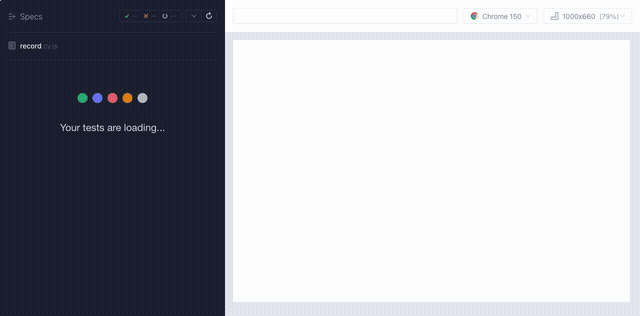

# cypress-device-emulate

[](https://www.npmjs.com/package/cypress-device-emulate)
[](https://www.npmjs.com/package/cypress-device-emulate)
[](https://github.com/sekharsdet/cypress-device-emulate/actions/workflows/ci.yml)
[](./LICENSE)

Mobile device emulation for Cypress. `cy.viewport()` only resizes the app under
test — it does not flip `@media (hover: none)` or `@media (pointer: coarse)`,
does not change `navigator.userAgent`, and does not expose the Touch API. This
plugin sets all of that correctly, by driving the Chrome DevTools Protocol
connection Cypress already has open — the same mechanism Chrome's own DevTools
Device Mode is built on.



|                                              | `cy.viewport()` | `cy.emulate()`     |
| -------------------------------------------- | --------------- | ------------------ |
| Resizes viewport                             | ✅              | ✅                 |
| `@media (hover: none)` / `(pointer: coarse)` | ❌              | ✅                 |
| `navigator.userAgent`                        | ❌              | ✅                 |
| Touch API (`ontouchstart`, `TouchEvent`)     | ❌              | ✅                 |
| Device pixel ratio                           | ❌              | ✅                 |
| `screen.orientation` + live rotation         | ❌              | ✅ (`cy.rotate()`) |
| `locale` / `timezoneId` / `geolocation`      | ❌              | ✅                 |

Chromium-based browsers only (Chrome, Edge, or Cypress's bundled Electron
browser). Firefox dropped Chrome DevTools Protocol support, so it is not
supported — `cy.emulate()` throws a clear error naming the detected browser if
you try.

## Installation

```
npm install --save-dev cypress-device-emulate
```

Register the commands by adding this to `cypress/support/e2e.js`:

```js
import 'cypress-device-emulate'
```

## Usage

```js
it('logs in on a Galaxy S25 and opens the mobile menu', () => {
  cy.emulate('Galaxy S25')
  cy.visit('https://www.saucedemo.com/')
  cy.get('[data-test="username"]').type('standard_user')
  cy.get('[data-test="password"]').type('secret_sauce')
  cy.get('[data-test="login-button"]').click()
  cy.get('[data-test="open-menu"]').should('be.visible')
})
```

## API

### cy.emulate(device)

Sets viewport, device pixel ratio, the mobile flag, touch support, user agent,
and screen orientation, for a named device from the catalog or a custom
descriptor.

```js
cy.emulate('iPhone 16')
cy.emulate(customDescriptor)
```

Custom descriptor fields:

- **viewport**: `{ width: number, height: number }`
- **deviceScaleFactor**: number
- **isMobile**: boolean
- **hasTouch**: boolean
- `Optional` **maxTouchPoints**: number, defaults to 5
- **userAgent**: string
- `Optional` **locale**: string
- `Optional` **timezoneId**: string
- `Optional` **geolocation**: `{ latitude: number, longitude: number, accuracy?: number }`, `accuracy` defaults to 1

```js
cy.emulate({
  viewport: { width: 410, height: 890 },
  deviceScaleFactor: 3,
  isMobile: true,
  hasTouch: true,
  userAgent: 'Mozilla/5.0 (Linux; Android 15; Pixel 9a) ...',
})
```

Every catalog entry also has a ` landscape` variant, e.g.
`cy.emulate("iPhone 16 landscape")`.

Call `cy.emulate()` before `cy.visit()` for full fidelity. It also works called
on an already-loaded page — viewport, user agent, device pixel ratio, and the
`hover`/`pointer` media queries all update immediately. The one exception is
`'ontouchstart' in window`, which Chromium decides at document creation and
does not flip until the page reloads:

```js
cy.visit('/')
cy.emulate('Pixel 9') // viewport/UA/media-queries correct immediately
cy.reload() // needed only if your code checks 'ontouchstart' in window
```

### cy.rotate(orientation)

Rotates whatever device is currently emulated, firing a real `orientationchange`
event and updating `window.screen.orientation` — not just a resize. Requires
`cy.emulate()` to have been called first in the same test.

```js
cy.rotate('portrait')
cy.rotate('landscape')
```

For a named catalog device, this uses that device's real landscape/portrait
counterpart — the same data as the ` landscape` catalog entries, not a naive
width/height swap. For a custom descriptor it swaps width/height, since there
is no catalog entry to look up. Calling it again with the same orientation is a
no-op.

### cy.resetEmulation()

Clears all emulation overrides and restores the configured viewport. Called
automatically after every test — CDP overrides are session-level in Chrome, not
per-test, so without this a test that never calls `cy.emulate()` would inherit
state left over from a previous test.

```js
cy.resetEmulation()
```

To manage resets yourself instead, disable the automatic hook:

```js
// cypress.config.js
module.exports = defineConfig({
  env: { cyDeviceEmulateAutoReset: false },
})
```

## Devices

```js
import { devices } from 'cypress-device-emulate'
```

About 80 phones and tablets:

- Android phones: Pixel 2 through Pixel 10 Pro XL, Galaxy S5/S8/S9+/S24/A55,
  plus Galaxy S25 and Galaxy S25 Ultra (community-added, see `src/devices.ts`).
- Android tablets and foldables: Galaxy Tab S4/S9, Galaxy Z Flip 6/7 (and their
  Cover screens), Galaxy Z Fold 6/7 (and their Cover screens).
- iPhone: iPhone 6 through iPhone 17 Pro Max / 17e / Air.
- iPad: iPad (gen 5/6/7/11), iPad Mini, iPad Pro 11.

Desktop browser profiles and long-discontinued devices (BlackBerry, Kindle
Fire, old Nexus/Lumia phones) are out of scope. Every descriptor is plain data
in `src/devices.ts`, so adding or updating a device is a data change, not a
code change — see [CONTRIBUTING.md](./CONTRIBUTING.md).

## Fidelity

Android devices are close to a real device, since real Android phones also run
Chromium under Chrome. iPhone and iPad profiles get viewport, touch, user
agent, and responsive CSS right, but still render in Chromium, not
WebKit/Safari — Safari-only rendering quirks will not reproduce. Use this for
responsive layout and touch-interaction testing, not for Safari-engine-specific
bugs.

`locale`, `timezoneId`, and `geolocation` work the same on Chrome and Edge. On
Electron, the geolocation permission grant silently no-ops (Electron's CDP
implementation does not support the `Browser.*` permission domain), but this
does not matter in practice: Electron does not gate `navigator.geolocation`
behind the Permissions API the way Chrome does, so `getCurrentPosition()` still
works.

Nothing in this library is platform-specific. CI runs on Ubuntu, Windows, and
macOS, on both Node 18 and 20: the full ~186-test suite under real Chrome, plus
the cross-browser regression tests under Electron.

## License

The project is licensed under the terms of the [MIT license](./LICENSE)
